# SUBSTANTIVE II — EXPANDED RESEARCH DOSSIER
## Meaningful Human Control: From Authorization to Operational Reality

> **Committee:** CCW — LAWS  
> **Country:** Federative Republic of Brazil  
> **Use:** Research, substantive chits, MODs, POIs, GSL preparation and drafting ammunition  
> **Core proposition:** Meaningful human control is a continuing condition of lawful employment, not a ceremonial moment of authorization.

---

## RESEARCH MAP

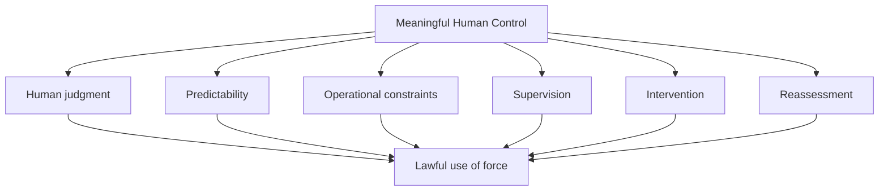

This document is deliberately different from Substantive I. The first substantive centres on **Accountability & Attribution**. This one asks a different question: **what must human beings actually understand, control and retain throughout the deployment chain for the concept of meaningful human control to have substantive legal content?**

---

# PART I — THE CONCEPTUAL ARCHITECTURE

## 01 — Meaningful Human Control Is a Functional Standard

The phrase “meaningful human control” can become empty if it is reduced to a declaration that a human remains somewhere in the chain of command. The stronger approach is functional: identify what the human actually knows, what the human decides, what the human can constrain, and what the human can change. This matters because autonomous functions vary dramatically. A human may designate a specific target while a system handles navigation. Another system may receive a generalized target profile and independently identify and engage objects. Both contain a human somewhere in the chain, but the distribution of decision-making is different.

Brazil should therefore resist a purely terminological debate. The question is not whether a system is labelled “human-in-the-loop” or “human-on-the-loop”. The question is whether the human retains sufficient judgment and control in the circumstances of use. The CCW's recent work describes human judgment and control as context-dependent, while ICRC analysis links control to predictability, supervision, intervention and operational restrictions. The result is a standard that must be applied to the **function, circumstances and effects** of the weapon rather than to the label attached to it.

**Brazilian line:** “A human presence is a fact. Meaningful human control is a legal and operational condition.”

---

## 02 — Human Agency and the Application of Force

The central issue is not whether machines may assist humans. Modern warfare already contains automated and highly computerized functions. The sharper question is where the human decision to apply force sits within the chain. When autonomy reaches identification, target selection or engagement, the system can begin determining facts that directly influence the use of force.

The ICRC emphasizes that the rules governing attacks are addressed to humans who plan, decide upon and carry out attacks, and that legal obligations cannot simply be transferred to a machine. Brazil should use this principle carefully. It does not mean every automated function is unlawful. It means that technological delegation cannot be used to erase the human agency on which compliance with IHL depends.

The deployment chain can therefore be divided into three broad layers: **human purpose, machine execution, and legal consequence**. The stronger the machine's role in the decision that produces force, the more carefully the State must establish how human judgment remains connected to that decision.

**POI:** “If the machine makes the final selection between multiple potential targets, which human judgment are you saying remains decisive?”

---

## 03 — Authorization Is Only the Beginning

A commander signing an authorization order does not automatically control every subsequent machine action. Authorization is an ex ante judgment; autonomous operation can continue after that judgment has been made. The distinction becomes important when circumstances change.

Consider a system authorized for a particular target category, geographic area and time window. If civilian presence increases, the system's performance degrades, the mission expands or the target environment changes materially, the original assumptions may no longer describe the operation. A framework that treats authorization as permanently sufficient risks disconnecting the human decision from the conditions in which force is eventually applied.

Brazil should therefore distinguish **authorization** from **continuing control**. This does not require a human to manually approve every machine action. It requires the authorization to remain connected to the foreseeable behaviour of the system and to contain meaningful mechanisms for restriction, intervention and reassessment.

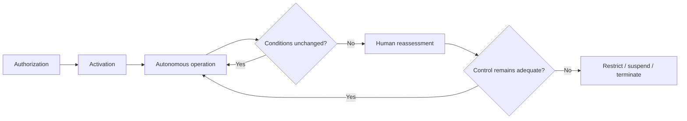

**Brazilian challenge:** “At what point does your framework require a second human judgment?”

---

## 04 — The Decision-Making Nexus

Brazil can frame meaningful control through the concept of a **decision-making nexus**: a substantive connection between human judgment, operational circumstances and the resulting use of force. The nexus is strong when a human understands the system, defines lawful parameters, knows the operational environment, can supervise relevant behaviour and can intervene when necessary. It weakens when the human merely authorizes a broad mission and the system independently determines the circumstances of engagement.

This concept is useful because it avoids the false choice between “manual weapons” and “fully autonomous weapons”. There are many intermediate arrangements. A system can automate navigation, detection, tracking, classification, target recommendation or engagement. The legal importance of each function depends on how it affects the use of force.

The closer the autonomous function sits to the final application of force, the more important the nexus becomes. Brazil should therefore ask delegations to identify **the exact human decision that remains legally decisive** rather than accepting generic statements about oversight.

**Core formula:**

> Human judgment + operational context + enforceable constraints + intervention = meaningful decision-making nexus.

---

## 05 — Why Identification, Selection and Engagement Matter

The words **identification, selection and engagement** are particularly useful because they map onto the chain through which force is applied. Identification concerns what the system believes it has detected. Selection concerns which detected object or person is chosen for attack. Engagement concerns the application of force.

A system that tracks a human-selected target is not necessarily performing the same function as a system that independently selects a target from a generalized profile. Brazil should therefore avoid treating “autonomy” as one undifferentiated category. The better approach is to identify which critical function has been delegated and then assess what human control remains around it.

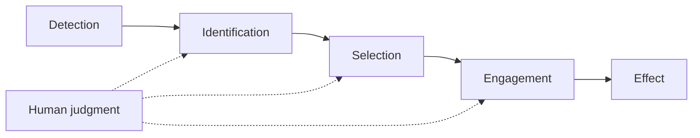

This is also strategically useful in debate. If another delegation says “a human is still in control,” Brazil can ask: **“At which of these functions does that human exercise the relevant judgment?”** The answer is much more revealing than the label “human-in-the-loop.”

---

## 06 — Human-in-the-Loop Is Not a Magic Phrase

“Human-in-the-loop” is often treated as synonymous with meaningful control. It is not. A human may technically be included in a loop while lacking the information, time, workload capacity or authority required to make an independent decision.

Similarly, “human-on-the-loop” can describe genuine supervision in one environment and almost ceremonial oversight in another. The difference depends on operational realities: how fast the system acts, how many engagements occur simultaneously, what information the operator receives, whether the operator can intervene, and whether the intervention can occur before force is applied.

Brazil should therefore say that labels are **descriptive, not dispositive**. They describe an architecture; they do not prove that the architecture satisfies the substantive requirements of human judgment and control.

**Questions to ask:**
- What can the human see?
- What can the human decide?
- How much time does the human have?
- How many systems are being supervised?
- What happens if the human disagrees with the machine?
- Can the human stop the engagement before the effect?

The answers constitute the real control assessment.

---

## 07 — Nominal Oversight Versus Effective Oversight

Nominal oversight exists when a human possesses formal authority but cannot realistically exercise it. Effective oversight exists when the human has sufficient information, time, authority and technical means to influence the operation.

The distinction becomes important where autonomous systems operate at high speed or at large scale. A person monitoring a single system in a controlled environment may be able to identify anomalies and intervene. The same person monitoring hundreds of simultaneous engagements may be unable to process all relevant information.

The 2026 CCW discussions included attention to training, understandable human-machine interfaces and automation bias, showing that human control is affected by the practical conditions under which people interact with autonomous systems.

Brazil should therefore avoid saying that “human oversight is useless.” The more precise argument is that **oversight must be operationally meaningful**.

**POI:** “Does your framework measure whether the operator can actually intervene, or merely whether the operator is formally assigned to supervise?”

That question forces a delegation to distinguish legal substance from administrative formality.

---

## 08 — Human Judgment Under IHL

IHL contains rules whose application depends on the circumstances of an attack. Distinction requires determining the relevant status of persons and objects. Proportionality requires an assessment of expected incidental civilian harm against anticipated concrete and direct military advantage. Precautions require feasible measures to avoid or minimize civilian harm.

These obligations cannot simply be reduced to a generic machine classification. A sensor can recognize a shape, signal or pattern; the legal judgment may require understanding the circumstances surrounding that object. This does not imply that machines can never assist in the process. It means the human-control architecture must preserve the human capacity to apply the relevant legal rules.

Brazil should therefore ask where the legal judgment occurs. If a human reviews a machine recommendation and retains the final decision, the system is functioning as decision support. If the machine itself decides when a generalized profile has been satisfied and applies force without further human intervention, the human-control inquiry becomes more demanding.

**Brazilian principle:** technical classification and legal judgment are related, but they are not interchangeable.

---

## 09 — MHC as a Continuing Condition

Meaningful control should be understood as continuing across the relevant lifecycle rather than being permanently established at the moment of acquisition or authorization. The 2026 CCW working paper explicitly frames responsibility and accountability across the entire lifecycle of LAWS. Earlier CCW work also discussed review and reassessment of changes in system functioning.

This matters because systems can be modified, software can change, missions can expand and operating environments can shift. Even if the initial authorization was well founded, later conditions may differ materially.

The lifecycle can be visualized as:

**Research → Design → Development → Testing → Legal review → Acquisition → Training → Authorization → Deployment → Operation → Monitoring → Investigation → Reassessment.**

Brazil should not claim that every stage requires identical human involvement. The point is that meaningful control must be preserved at the stages where human judgment is legally and operationally consequential.

**Key question:** “Which stage in your lifecycle model is the last point at which human control can meaningfully change the system's employment?”

---

## 10 — Brazil's Five-Capacity Test

Brazil can translate the broad concept of meaningful human control into five capacities:

### UNDERSTAND
Know the system's capabilities, limitations and relevant failure modes.

### ANTICIPATE
Understand expected behaviour within the intended operational envelope.

### CONSTRAIN
Set enforceable limits on mission, target, geography, time and scope.

### INTERVENE
Retain a realistic ability to interrupt, deactivate or alter employment.

### REASSESS
Reconsider authorization when material circumstances change.

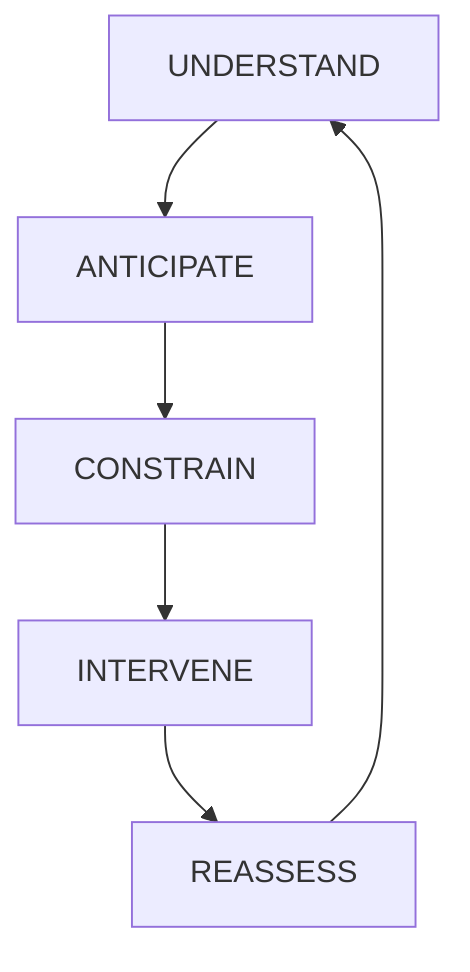

This is not a substitute for IHL and should not be presented as a universal numerical checklist. It is a framework for testing whether the claimed human role has substantive content.

A State that can demonstrate all five capacities has a much stronger basis for arguing that its human-control architecture is meaningful. A State that can demonstrate only formal authorization has a much weaker basis.

**Brazilian phrase:** “We are not demanding a human button-pusher. We are demanding a human decision-maker with genuine operational agency.”

---

# PART II — CONTROL ACROSS THE DEPLOYMENT CHAIN

## 11 — Research, Development and Design

Meaningful control begins before a weapon reaches the battlefield. Design determines what the system can perceive, which variables it uses, what parameters can be imposed and whether humans can intervene.

A system cannot be meaningfully controlled through a safeguard that the design makes technically ineffective. For example, if a geographic restriction cannot be enforced, writing that restriction into a commander's order may not be enough. If a human cannot understand a system's relevant limitations, training alone may not solve the problem. If the system cannot be deactivated under expected conditions, a theoretical intervention policy may have little practical value.

Brazil should therefore treat design as part of the control architecture. The design stage should answer: What can the system do? What can it not do? What assumptions does it rely upon? Which parameters can humans change? Which changes require renewed validation? What happens when communications fail?

**Research principle:** technical design choices can determine whether later legal safeguards are substantive or merely declaratory.

---

## 12 — Training Data and System Behaviour

Machine-learning systems can depend heavily on the data used to train and validate them. Brazil should avoid the simplistic claim that “bad data automatically makes a weapon unlawful.” The legal issue is the system's actual performance and whether it can be lawfully employed in the intended circumstances. Nevertheless, data limitations can affect classification, robustness and predictability.

Relevant questions include whether the system was trained and tested against representative environments, target types and operational conditions; whether known limitations were documented; and whether operators were trained to understand where performance may degrade.

The ICRC's current AI work identifies unpredictability, explainability, bias and over-reliance as relevant concerns. These concerns become operationally significant when machine outputs influence the application of force.

**POI:** “What evidence demonstrates that your system's validation conditions represent the environment in which you intend to employ it?”

That question is more rigorous than simply asking whether the system is accurate.

---

## 13 — Testing and Validation

Testing should establish more than ideal-case performance. A system may perform extremely well under controlled conditions while encountering different inputs in a dynamic operational environment.

Brazil should therefore distinguish **testing**, **validation** and **operational assurance**. Testing asks whether the system performs as intended under specified conditions. Validation asks whether those conditions and results are representative of the intended use. Operational assurance asks whether the human decision-maker has sufficient confidence that the system remains within its validated envelope during actual employment.

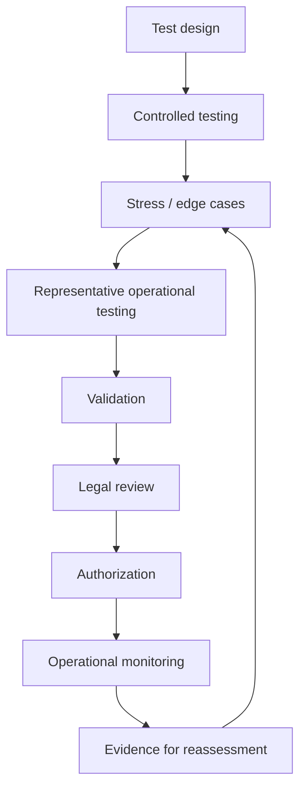

The ICRC has identified predictability and reliability as practical challenges in legal reviews of autonomous weapons. Brazil can therefore argue that testing must be linked to the actual circumstances of intended use.

**Key question:** “Validated where, against what, and for how long?”

---

## 14 — Operational Authorization

Authorization should be based on sufficient information about the system and the mission. A commander should understand the relevant capabilities, limitations, target categories, operating environment, geographic scope, duration and intervention mechanisms.

A broad authorization can create a larger gap between the human decision and the later machine action. A narrow authorization can reduce the range of circumstances in which the system is permitted to operate. Brazil should therefore treat specificity as one possible mechanism for preserving control.

This does not require manual approval of every machine movement. It requires the authorization to remain meaningfully connected to the expected use of force.

**Authorization matrix:**

| Parameter | Human question |
|---|---|
| Task | What is the system being asked to do? |
| Target | What may it engage? |
| Geography | Where may it operate? |
| Time | For how long? |
| Environment | Under what conditions? |
| Scale | How many simultaneous functions? |
| Intervention | How can a human stop it? |
| Reassessment | What changes trigger review? |

This matrix is useful both for drafting and for attacking vague national positions.

---

## 15 — Rules of Engagement as a Control Architecture

Rules of engagement are not simply legal documents sitting beside a weapon. In an autonomous system, the relationship between human instructions and technical constraints can become crucial. If the commander imposes a target restriction but the system cannot technically enforce it, the restriction may not function as an effective control.

The 2026 CCW working paper discusses understandable human-machine interfaces, guidance and instructions, training and responsible chains of human command and control. A 2024 CCW working paper also proposed appropriate rules of engagement and operational directives as part of accountability safeguards.

Brazil should therefore ask whether a rule exists only on paper or whether it is translated into an operational constraint.

**Strong POI:** “Where, technically, is the legal restriction you just described implemented in the system?”

A delegation can respond that the restriction is contained in orders, software, mission planning or multiple layers. Brazil's follow-up can then ask which layer prevents the system from violating the restriction if human supervision fails.

---

## 16 — Target Selection

Target selection is a particularly important dividing line. A human may select a particular target and allow a system to handle navigation. Alternatively, a human may define a generalized target profile and allow the system to identify and select particular targets within that profile.

The second arrangement creates a greater need to examine how the system handles context. The target profile may be technically precise but legally incomplete. An object can match a physical signature without every surrounding circumstance being captured by the machine's classification.

Brazil should therefore ask whether the system is making a technical selection, a legal selection, or both. If the human defines the target category but the system determines which object will actually be attacked, where is the final human judgment exercised?

**POI:** “Is the human selecting the target, or merely selecting the criteria by which the machine will select the target?”

That distinction can force a delegate to clarify the true allocation of decision-making.

---

## 17 — Engagement Decisions

Engagement is where the targeting process becomes force. The human may have established the mission and parameters, but the system can still determine the moment at which force is applied.

Brazil should examine three questions: **Was the human able to anticipate the circumstances of engagement? Were the system's actions constrained to the authorized conditions? Could the human intervene before the critical effect?**

The answer need not be identical for every autonomous system. A tightly bounded defensive system operating in a controlled environment may raise different questions from a system searching for generalized targets in a populated area.

The important point is that the human-control assessment should be tied to the actual engagement mechanism. A statement that “the commander remains responsible” does not identify whether the commander retained meaningful control over the engagement decision.

**Brazilian formulation:** “Responsibility should correspond to decision-making capacity, not merely hierarchical position.”

---

## 18 — Human Supervision

Supervision is meaningful when it allows a human to understand relevant system activity and influence the operation. It is weaker when the operator receives excessive information, insufficient context or insufficient time to act.

The 2026 CCW discussion of automation bias is relevant because humans can become over-reliant on machine outputs. A supervisor who is formally authorized to intervene may still rarely challenge the system if the interface encourages automatic acceptance or if the workload is too high.

Brazil should therefore treat supervision as a combination of:

**information + attention + authority + time + intervention capability.**

If the chain is too fast or too overloaded for meaningful evaluation, the existence of the human role may not be sufficient.

**POI:** “How does your framework account for the human operator's workload?”

---

## 19 — Intervention and Deactivation

The ability to intervene is meaningful only if intervention is technically and operationally feasible. A system may have a deactivation command but still operate too quickly for a human to use it effectively.

Brazil should assess intervention through five questions:

1. Does the human know when intervention is necessary?
2. Does the human receive enough information to decide?
3. Is sufficient time available?
4. Can the intervention command actually reach the system?
5. Does intervention prevent or terminate the relevant effect?

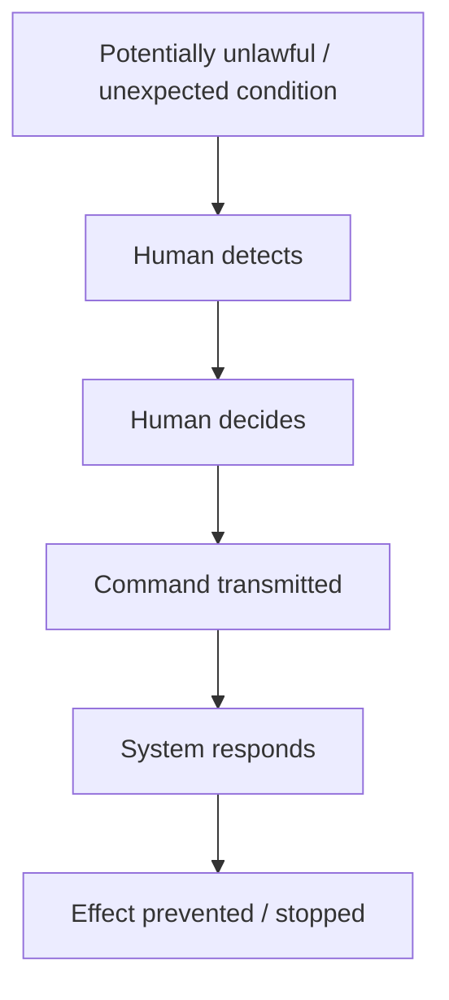

Every step matters. A safeguard can fail at detection, decision, communication or execution. Brazil should therefore resist the argument that the mere existence of a “kill switch” conclusively proves meaningful control.

**POI:** “Can your operator intervene before the critical effect, or only after the system has already acted?”

---

## 20 — Post-Strike Review and Feedback

Post-strike review serves a different purpose from real-time control. It cannot prevent an attack that has already occurred, but it can reveal failures, improve training, identify problematic parameters and inform future legal reviews.

The 2026 CCW working paper supports effective internal mechanisms for investigation, reporting and appropriate action following incidents that may involve IHL violations. It also records discussion of traceability through data logs and audit trails.

Brazil should therefore advocate a complete learning loop:

**Deployment → record → investigate → identify cause → correct → retrain → reassess.**

This is particularly important for autonomous systems because an incident may involve interactions among software, operator decisions, environmental conditions and machine behaviour.

**Important distinction:** after-action review strengthens accountability and future control; it does not retroactively create the human judgment that was missing at the moment force was applied.

---

# PART III — PREDICTABILITY AND TECHNICAL ASSURANCE

## 21 — Predictability as a Condition of Control

A human cannot meaningfully control a system whose relevant behaviour cannot be sufficiently anticipated in the circumstances of use. Predictability therefore has a direct relationship with human control.

The ICRC has long linked effective control to predictability and reliability and has emphasized operational factors such as task, target, environment, geographic space and time. Brazil should use this to reject simplistic claims that a system's general reliability proves that every use is predictable.

The correct question is:

> **Can the responsible human anticipate the system's relevant behaviour and effects in the circumstances for which the system is being used?**

A system can be highly predictable within a narrow envelope and less predictable outside it. That makes the definition of the operational envelope crucial.

**POI:** “Predictable under which circumstances?”

That three-word follow-up can expose a surprisingly large amount of ambiguity.

---

## 22 — Reliability Is Not Predictability

Reliability concerns consistent performance of a function. Predictability concerns whether humans can reasonably anticipate behaviour and effects. The concepts overlap but are not identical.

A system could reliably execute an algorithm that is inappropriate for the circumstances. Conversely, a system could have detectable technical errors that remain manageable because human supervision and intervention are effective.

Brazil should therefore resist a debate reduced to percentages. A statement such as “the system is 99% accurate” immediately raises questions: accurate at what task? Under which conditions? Against which targets? What is the severity of the remaining errors? Are the errors randomly distributed or concentrated in particular environments? Can an operator identify uncertainty?

**Brazilian line:** “A performance statistic is not a legal conclusion.”

The more consequential the autonomous function, the more important it is to connect technical evidence to the actual operational circumstances in which the weapon will be used.

---

## 23 — Explainability as Operational Knowledge

Explainability should not be misunderstood as a demand that every commander understand source code. The relevant question is whether the humans responsible for use have enough information about the system's capabilities, limitations and expected effects to make informed decisions.

Explainability can also matter after an incident. If authorities cannot reconstruct why a system produced a particular output, identifying failures and assigning appropriate responsibility becomes more difficult.

Brazil should therefore distinguish **technical explainability** from **decision-useful explainability**. A commander may not need a mathematical derivation of every model output, but may need to know the conditions under which the system is reliable, the types of uncertainty it produces and the operational restrictions required to keep its use within lawful bounds.

The 2024 Brazil-related CCW material connects meaningful control with the ability to explain and predict effects. The 2025 CCW process also considered explainability among relevant concepts.

**POI:** “What must the operator understand about the system before you consider their authorization informed?”

---

## 24 — The Black-Box Problem

Complexity is not automatically illegality. The problem arises when opacity prevents the responsible human from understanding the information needed to exercise judgment.

A black-box system may be acceptable for one function and problematic for another. If it assists logistics, the consequences of opacity may differ from a system whose output directly determines which target receives lethal force. Brazil should therefore focus on the **consequence of opacity** rather than using “black box” as a rhetorical label.

The ICRC has highlighted difficulties in predicting, understanding, explaining and testing certain machine-learning systems. Brazil can translate that concern into an operational question: if the human cannot understand the system's relevant limitations, how can the human know when its output should be trusted, challenged or rejected?

**Brazilian principle:** “Complexity does not remove responsibility; it increases the importance of meaningful human understanding.”

This is a much stronger argument than claiming that every machine-learning system is inherently unlawful.

---

## 25 — Confidence Scores Are Not Legal Judgments

A machine may output a confidence score. That score can be useful, but it does not automatically correspond to the legal certainty required for an attack.

The meaning of a confidence score depends on the model, dataset, calibration, validation conditions and task. A 95% score does not mean “95% lawful target.” It may mean the model assigns a probability to a technical classification under a particular statistical framework.

Brazil should therefore insist that uncertainty be communicated in a way humans can interpret and act upon. If uncertainty crosses a relevant threshold, the system may need to defer to human assessment, narrow its operation or stop.

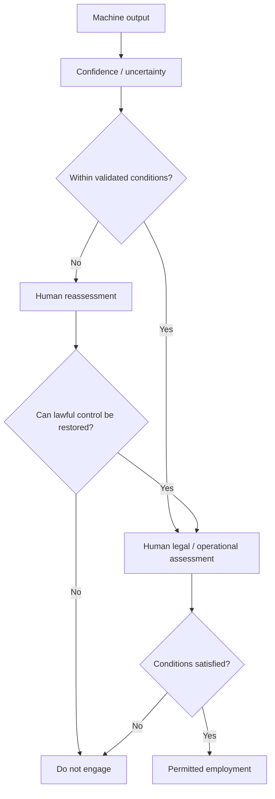

**POI:** “What does your confidence score actually measure?”

---

## 26 — Distribution Shift and Unfamiliar Conditions

A system can perform differently when deployed outside the environment represented during testing. Changes in terrain, lighting, weather, sensor quality, adversarial tactics, target appearance or civilian presence can affect performance.

Brazil should not argue that any environmental change automatically invalidates a system. The stronger point is that **material deviations from validated conditions can affect the factual basis of human authorization**.

This is why the operational envelope matters. The State should know the circumstances under which system performance has been tested and the circumstances in which it should not be relied upon.

**POI:** “What tells your operator that the system has moved outside its validated operational envelope?”

If the answer is simply “the operator is trained,” Brazil can ask what information the operator receives to recognize the deviation. Training is useful only when connected to observable indicators and meaningful authority to act.

---

## 27 — Adaptive and Learning Systems

Not all autonomous weapons use machine learning, and not all machine-learning systems learn during deployment. Brazil should preserve that distinction. The concern arises where a system can materially change its behaviour after the human assessment that supported authorization.

If a system's parameters or learned model change, the State should know whether the change affects a characteristic material to the legal review or operational validation. The relevant question is not “Does it learn?” in the abstract. It is: **“Does the change alter the conditions on which meaningful human control was based?”**

A sensible lifecycle model is:

**Baseline → modification → testing → validation → authorization → monitoring → reassessment.**

This approach avoids both extremes: assuming all adaptive systems are inherently unlawful, or assuming that adaptation is irrelevant to human control.

**POI:** “If the system changes its behaviour after authorization, what preserves the validity of the original human judgment?”

---

## 28 — Multiple-System Interaction and Swarms

A human may understand one autonomous system while having much less ability to predict the aggregate behaviour of many interacting systems. Interaction can create additional complexity through shared information, coordinated movement, target allocation or feedback among systems.

The ICRC has previously identified increasing interaction among systems, including swarms, as a factor that can affect predictability. Brazil should therefore ask whether the human-control architecture is designed for the **aggregate system**, not merely for each individual component.

Important variables include the number of systems, number of simultaneous engagements, communication structure, operator workload and ability to intervene in the collective behaviour.

**POI:** “If your operator understands each system individually but cannot predict their collective behaviour, what exactly is the human controlling?”

This question is especially useful because it does not assume that swarming is automatically unlawful. It asks whether the claimed human control actually corresponds to the operational system as a whole.

---

## 29 — Failure Modes

A serious control framework does not assume technological perfection. It identifies foreseeable failure modes and establishes what humans should do when those failures occur.

Brazil can analyse failure through five stages:

**failure → detection → human awareness → intervention → consequence.**

If a critical failure is detectable only after lethal force has already been applied, the intervention mechanism may be too late. If the operator is alerted but cannot understand the significance of the alert, awareness does not become meaningful judgment. If intervention exists but communications are unavailable, the technical safeguard may fail operationally.

The 2026 CCW discussions emphasize training, system capabilities and limitations, incident investigation and traceability. These elements support a lifecycle approach in which failures are anticipated, detected and learned from.

**Brazilian principle:** meaningful control does not require zero failures; it requires that relevant limitations and foreseeable failures be incorporated into the human-control architecture.

---

## 30 — Accuracy Is Not Lawfulness

A weapon can accurately identify an object while the overall engagement remains legally problematic. For example, the system may correctly classify a vehicle according to a trained signature without possessing all contextual information relevant to whether attacking that vehicle is lawful at that moment.

Brazil should therefore distinguish:

**classification accuracy → target assessment → legal judgment → engagement.**

The first is technical. The latter stages involve operational and legal context.

The ICRC's work on AI in military operations emphasizes that AI systems can support decision-making but can also introduce unpredictability, over-reliance and other risks. Brazil should use this to challenge the idea that a high accuracy percentage settles the human-control debate.

**Brazilian phrase:** “A reliable classifier does not automatically produce a lawful targeting decision.”

This sentence is useful because it concedes what technology may genuinely achieve while refusing to let technical performance become a substitute for legal judgment.

---

# PART IV — THE OPERATIONAL ENVIRONMENT

## 31 — Environment Is Part of the Control Assessment

The same system can present different control questions in different environments. A narrowly bounded system operating against a predictable category of military objects may be easier to constrain than a system operating in a dense, dynamic civilian environment.

The ICRC has identified task, target, environment, geographic space and time as relevant dimensions of human control. Brazil should therefore avoid universal statements such as “this system is predictable” without asking “predictable in which circumstances?”

A useful analytical equation is:

**System + task + target + environment + duration + scale = control assessment.**

This approach makes Brazil's position more sophisticated because it recognizes that autonomy is not a binary property. The legal and humanitarian implications depend on how and where the autonomy is employed.

**POI:** “Would you apply the same human-control standard to the same system in an empty test range and in a densely populated city?”

The question forces the delegation to confront context without presupposing the answer.

---

## 32 — Urban Warfare and Civilian Density

Urban environments can make autonomous targeting more difficult because civilian objects, military objectives and individuals may be physically intermingled and circumstances can change rapidly.

Brazil should not claim that every autonomous function is automatically unlawful in every urban environment. Instead, ask whether the system's target identification, selection and engagement functions remain sufficiently predictable and constrained for the actual environment.

Civilian density can increase the consequences of misclassification and make precautions more complex. It can also reduce the relevance of generalized target profiles because legally relevant circumstances may depend heavily on immediate context.

**POI:** “What restriction prevents your system from treating a dynamic urban environment as though it were the controlled environment in which it was validated?”

This question links environment, predictability and precautions without making an unsupported allegation about any specific State.

---

## 33 — Dynamic Battlefields

A dynamic battlefield creates a temporal problem for authorization. A judgment made at one moment may become outdated as targets move, civilians enter an area, units reposition or communications change.

Brazil should therefore treat duration as a control variable. The longer an autonomous system operates without meaningful human reassessment, the greater the need to establish that the relevant assumptions remain valid.

This does not mean that every autonomous function requires constant manual intervention. It means the permissible duration should be connected to the stability of the environment and the predictability of the system.

**POI:** “How long does your authorization remain valid if the circumstances that justified it are continuously changing?”

This question can expose whether a delegation has a genuine reassessment mechanism or treats an initial authorization as permanently sufficient.

---

## 34 — Geographic Restrictions

Geographic restrictions can narrow the operating environment and reduce uncertainty. But a restriction written in an order is not necessarily equivalent to a restriction that the technical system can actually enforce.

Brazil should ask how boundaries are implemented, monitored and changed. Can the system recognize its permitted area? What happens near the boundary? Can the area be expanded without fresh human authorization? What occurs if navigation uncertainty makes the boundary ambiguous?

The ICRC identifies geographical space as one dimension through which human control can be exercised. Brazil can therefore present geography as a practical control parameter rather than merely an administrative detail.

**POI:** “If geography is one of your safeguards, what technically prevents the system from operating outside the geographical conditions that formed the basis of authorization?”

A strong answer should identify an actual mechanism.

---

## 35 — Temporal Restrictions

Time can function as a control parameter. A shorter autonomous operating window can reduce the period during which circumstances may diverge from the assumptions underlying authorization.

Brazil should examine whether the system has a defined operating duration, whether it can continue beyond that period and whether extension requires fresh human judgment.

The relevant relationship is:

**duration of autonomy ↔ stability of assumptions ↔ predictability of effects.**

A short autonomous period does not automatically establish lawfulness, and a long period does not automatically establish unlawfulness. The point is that duration is relevant to whether the human decision remains connected to the circumstances in which force is applied.

**POI:** “What event ends the validity of the original human authorization?”

If the answer is simply “the mission ends,” Brazil can ask who determines whether the mission has materially changed before that point.

---

## 36 — Target-Type Restrictions

Target restrictions can narrow the range of objects or persons a system is permitted to engage. This may help reduce uncertainty, but only if the restrictions are sufficiently precise and technically enforceable.

Brazil should distinguish between a target category and a lawful target determination. A machine can recognize a physical signature while the legal status of an object may depend on circumstances that are not fully represented by that signature.

The 2026 CCW work discusses guidance, system capabilities, training and responsible human command and control. These elements support a framework where target restrictions are connected to human understanding and operational constraints.

**POI:** “Who determines that every object matching your machine's target category is legally engageable in the circumstances?”

That question highlights the distinction between technical classification and legal judgment.

---

## 37 — Scale and Human Workload

Human control has a practical capacity limit. A person may meaningfully supervise a small number of autonomous processes but struggle to exercise the same level of judgment over hundreds or thousands of simultaneous engagements.

Scale should therefore be part of the control assessment. Relevant factors include number of systems, number of targets, engagement speed, information quality, operator training, interface design and intervention time.

The 2026 CCW discussion of automation bias is especially relevant here. A highly automated environment can encourage operators to accept system outputs rather than independently evaluating them.

**POI:** “Does your definition of meaningful human control change when one human is supervising one autonomous engagement versus hundreds simultaneously?”

If the answer is no, Brazil can challenge the standard as insufficiently attentive to operational reality.

---

## 38 — Communications Failure and Degraded Conditions

Loss of communications can change the human-machine relationship. A system may continue operating after losing connectivity, but the significance depends on what constraints remain active, how long autonomy continues and whether the degraded condition was anticipated.

Brazil should distinguish between systems that terminate safely, systems that continue within narrow predetermined constraints and systems that continue with broad discretion.

The central question is:

> **What preserves meaningful human control when the human can no longer communicate with the system?**

A credible framework should identify technical limits, time limits, deactivation procedures or other safeguards. Merely pointing to the original authorization may not be enough if the operational circumstances have materially changed.

**POI:** “If the operator loses communication at the critical moment, what human-control mechanism remains?”

---

## 39 — Changing Mission Parameters

Mission parameters can change during operation: target categories may expand, geography may change, the duration may be extended or the environment may become more populated.

Brazil should distinguish between changes that remain within the validated operational envelope and **material changes that alter the factual basis of the original human judgment**.

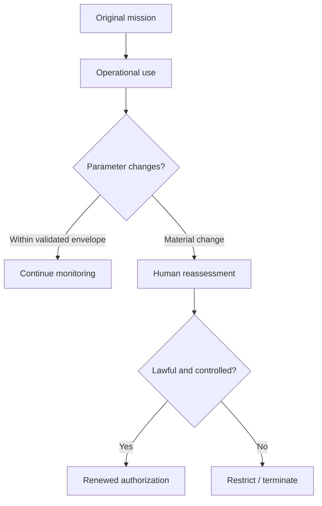

This prevents two extremes. The framework should not require bureaucratic reauthorization for every trivial adjustment, but neither should a broad authorization silently expand into a fundamentally different mission.

**Brazilian principle:** a materially changed mission can require materially renewed human judgment.

---

## 40 — Reassessment During Deployment

Reassessment is the bridge between static authorization and dynamic warfare. The trigger should be a material change relevant to the original assessment.

Possible triggers include changed target environment, civilian presence, system behaviour, operating area, mission duration, software configuration, communications or scale. The purpose is not bureaucratic repetition; it is to ensure that the human judgment supporting continued autonomy remains connected to reality.

**Reassessment sequence:**

**Change detected → significance assessed → human judgment → authorization renewed, restricted or withdrawn.**

The 2024 Brazil-related CCW material and wider CCW discussions have emphasized review and reassessment of changes to system functioning. Brazil should therefore make reassessment an operational concept rather than a vague promise of “continued oversight.”

**POI:** “What specific event under your framework forces the responsible human to reconsider an authorization already given?”

---

# PART V — IHL, LEGAL REVIEW AND INTERNATIONAL RULES

## 41 — Article 36 Weapons Reviews

Article 36 of Additional Protocol I requires a State party to determine whether employment of a new weapon, means or method of warfare would, in some or all circumstances, be prohibited by applicable international law. The ICRC identifies legal review as a critical tool for assessing new weapons.

For autonomous systems, review can be challenging because the reviewer needs sufficient information about system characteristics, intended use and expected behaviour. A review based on incomplete assumptions may be less informative than one connected to realistic operational circumstances.

Brazil should therefore frame legal review as part of lifecycle governance. Development, modification, acquisition and intended employment can all affect the review.

**Precision for committee:** Article 36 is a treaty obligation for States party to Additional Protocol I. Brazil should not inaccurately describe it as a universal treaty obligation applicable identically to every State.

**POI:** “What evidence does your legal review use to establish how the system will behave in its intended operational environment?”

---

## 42 — Distinction and Autonomous Targeting

Distinction requires parties to distinguish between civilians and civilian objects and combatants and military objectives, subject to the applicable rules. Autonomous targeting therefore raises a question about whether the system can perform the relevant identification and selection within the circumstances for which it is employed.

Brazil should not argue that machines can never classify objects. The stronger argument is that **classification capability is not automatically equivalent to the legal judgment required for an attack**.

Where status depends on context, behaviour or changing circumstances, the system's ability to recognize legally relevant distinctions becomes particularly important. The ICRC has emphasized the difficulty of systems operating where human status and circumstances are highly contextual.

**POI:** “Does your system identify a technical signature, or does it determine the legally relevant status required for lawful engagement?”

That distinction is valuable because it separates sensor capability from legal judgment.

---

## 43 — Proportionality and Contextual Judgment

Proportionality requires assessing expected incidental civilian harm in relation to the anticipated concrete and direct military advantage. The assessment is inherently contextual.

Brazil should therefore ask whether the human decision-maker retains enough situational understanding to perform the judgment required before attack. If an autonomous system independently determines when and where force is applied, the human-control question becomes especially important.

Brazil does not need to argue that every proportionality assessment must be manually recalculated before every machine engagement. The stronger position is that the chosen system, parameters and operating environment must permit the responsible humans to comply with the applicable obligation.

**POI:** “Where, precisely, is the proportionality judgment exercised in your deployment chain?”

If the answer points only to an initial authorization, Brazil can ask whether later autonomous changes in target, timing or circumstances are incorporated into that judgment.

---

## 44 — Precautions in Attack

Precautions can include choices about the time and place of operation, monitoring, target restrictions and other measures that reduce civilian danger. A 2024 CCW working paper proposed measures such as adjusting location or timing, monitoring autonomous operation and choosing operational parameters that reduce civilian risk.

Brazil can therefore integrate precautions into the human-control framework. Human control is not merely the ability to stop a weapon; it is also the ability to choose the conditions under which it is allowed to operate.

**Operational sequence:**

**Identify risk → consider feasible precaution → impose restriction → monitor → reassess.**

This is especially useful because it ties the abstract concept of MHC to an existing IHL obligation. A delegation cannot simply say “the weapon is autonomous but the commander is responsible.” Brazil can ask what precautionary choices the commander made before and during employment.

**POI:** “What feasible precaution did the responsible human impose specifically because of the system's autonomous characteristics?”

---

## 45 — Unpredictable Effects

Unpredictability is not synonymous with the mere possibility of error. The stronger concern is whether the human decision-maker can sufficiently understand and anticipate relevant effects to exercise lawful judgment.

The ICRC's current position paper identifies unpredictability and reduced human control as significant concerns, while Brazil's 2024 CCW material links meaningful control with sufficient understanding, prediction and explanation of effects.

Brazil should therefore avoid a “zero-error” standard. A more defensible formulation is:

> **The relevant threshold is sufficient understanding and predictability for the circumstances and function in which the weapon is used.**

This allows Brazil to distinguish ordinary technical imperfection from a system whose behaviour is insufficiently predictable for the human to make a lawful decision.

**POI:** “Are you demonstrating that the system is error-free, or that its relevant behaviour and effects are sufficiently predictable for lawful use?”

The latter is the legally and analytically stronger question.

---

## 46 — Existing IHL and New International Rules

Existing IHL applies to new means and methods of warfare. The debate over LAWS therefore does not begin from a legal vacuum. The question is whether existing rules are sufficient in practice and whether additional international rules are needed to clarify, prohibit or regulate particular autonomous functions and risks.

UN General Assembly resolution 80/57, adopted in 2025, stresses the importance of human roles in the use of force, responsibility and accountability and calls for work toward completing elements for an instrument in the CCW GGE process. It also notes the Secretary-General's call for a legally binding instrument using a two-tier approach.

Brazil should therefore frame new rules as **complementary to existing IHL**. This avoids the false argument that either existing law solves everything or that new rules require abandoning existing law.

**Brazilian line:** “The question is not whether IHL applies. The question is whether the international community will ensure that autonomy does not make compliance merely theoretical.”

---

## 47 — Brazil's Two-Tier Architecture

Brazil's two-tier approach can be integrated into the operational-control framework.

**Tier I — Prohibition:** systems or uses that cannot satisfy applicable international law and meaningful human control should not be permitted.

**Tier II — Regulation:** permissible systems should operate under binding restrictions sufficient to preserve meaningful human control, compliance with IHL and accountability.

The 2025 UN General Assembly resolution records the Secretary-General's call for a legally binding instrument based on prohibitions and regulations. Brazil can therefore connect its two-tier approach to the broader international debate without claiming that the General Assembly resolution itself created the proposed treaty.

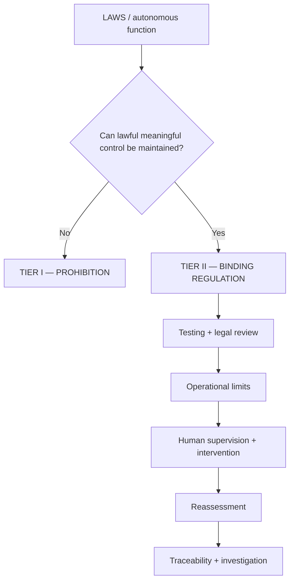

The strength of Tier II depends upon whether its safeguards are operationally enforceable rather than merely declaratory.

---

## 48 — The Brazil Meaningful-Control Test

The dossier can now be compressed into a single Brazilian test:

### UNDERSTAND
Does the responsible human understand capabilities, limitations and relevant failure modes?

### ANTICIPATE
Can behaviour and effects be sufficiently anticipated in the intended circumstances?

### CONSTRAIN
Can humans define and enforce limits on task, targets, geography, duration and scope?

### INTERVENE
Can humans realistically interrupt or deactivate before the critical effect?

### REASSESS
Does material change trigger renewed human judgment?

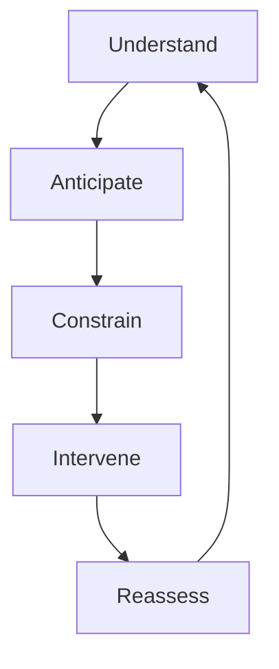

The test is intentionally contextual. It does not impose an identical technological architecture on every weapon. It asks whether the particular architecture preserves enough human judgment and control for the particular circumstances.

**Conference version:** “Brazil's test is simple: understand the system, anticipate its relevant behaviour, constrain its use, retain meaningful intervention, and reassess when the circumstances materially change.”

---

## 49 — Counterarguments and Brazil's Rebuttals

### “Existing IHL is sufficient.”
Existing IHL applies. Brazil's argument is that autonomy creates practical questions about how human beings can comply with those obligations, and specific international safeguards can strengthen compliance.

### “Humans remain responsible.”
Responsibility cannot be established merely by naming a human. The question is whether the human retained the knowledge, authority and control relevant to the decision.

### “Our system is highly accurate.”
Accuracy is one technical property. Predictability, context, reliability, constraints, intervention and legal circumstances remain relevant.

### “We have a kill switch.”
A theoretical veto does not prove meaningful intervention. The operator must know when intervention is necessary and be able to act in time.

### “National discretion is necessary.”
Operational flexibility can exist within minimum international standards. The question is what baseline prevents accountability and human control from becoming entirely dependent on national interpretation.

### “This would hinder innovation.”
Clear international rules can define the conditions for responsible development and employment rather than prohibiting technological research as such.

**Brazilian debate rule:** do not attack technology. Attack **unbounded delegation of legally consequential judgment**.

---

## 50 — The International Framework Brazil Wants to See

Brazil's framework should connect every stage of the deployment chain rather than treating human control as a single event.

The international framework should preserve meaningful human judgment and accountability throughout the relevant lifecycle. It should address autonomous systems according to their functions and circumstances of use rather than relying exclusively on labels. It should establish minimum expectations for understanding, testing, predictability, operational restrictions, supervision, intervention, training, legal review, traceability and reassessment.

The framework should also recognize that meaningful control is not identical across every system. The appropriate degree and form of human involvement depends on the system's capabilities, task, targets, environment, duration, scale and foreseeable effects.

**Final Brazilian principle:** autonomy may be incorporated into military technology; **the conditions governing the lawful use of force cannot be delegated beyond meaningful human judgment.**

---

# VISUAL ONE-PAGE SUMMARY

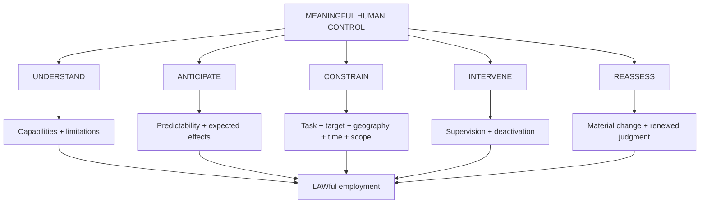

### The five questions Brazil should always ask

**1. UNDERSTAND:** What does the human actually know?  
**2. ANTICIPATE:** What can the human reasonably foresee?  
**3. CONSTRAIN:** What can the human actually limit?  
**4. INTERVENE:** What can the human stop, and in what time?  
**5. REASSESS:** What change forces a new judgment?

---

# 40 RAPID-FIRE POIs DERIVED FROM THIS SUBSTANTIVE

1. What exactly makes your human control “meaningful” rather than merely formal?
2. Does authorization constitute continuing control?
3. Which human makes the final targeting judgment?
4. Is the human selecting the target or merely the criteria?
5. What information does the operator receive before authorization?
6. What evidence establishes predictability in the actual environment of use?
7. How do you distinguish reliability from predictability?
8. What does the system's confidence score actually measure?
9. What happens when the system leaves its validated operational envelope?
10. What triggers mandatory reassessment?
11. How are geographic restrictions technically enforced?
12. How are temporal restrictions enforced?
13. What happens when communications are lost?
14. What happens when the mission changes materially?
15. How many autonomous decisions can one operator supervise meaningfully?
16. How does your framework address automation bias?
17. What does the operator understand about system limitations?
18. Can the operator intervene before the critical effect?
19. How quickly can deactivation occur?
20. What happens if deactivation fails?
21. Where is the proportionality judgment exercised?
22. Where is the precautionary judgment exercised?
23. Does technical classification equal legal target status?
24. What prevents a target profile from becoming overbroad?
25. What evidence supports your legal review?
26. How does your legal review account for dynamic environments?
27. What happens after a material software modification?
28. Does your framework cover the whole lifecycle?
29. What records permit reconstruction after an incident?
30. Who can suspend autonomous operation?
31. What happens when the system behaves unexpectedly?
32. What happens when many autonomous systems interact?
33. Can one human meaningfully supervise a swarm?
34. How do you prevent human oversight from becoming rubber-stamping?
35. What distinguishes your framework from merely assigning responsibility to a commander?
36. Can a human be responsible for a decision they could not meaningfully control?
37. What minimum international standard prevents human control from becoming purely discretionary?
38. How does your framework preserve human judgment when operational tempo exceeds human reaction time?
39. What happens when the factual basis for authorization changes?
40. If the machine makes the decisive lethal choice, what exactly remains human-controlled?

---

# MASTER SOURCE BANK

## PRIMARY UN / CCW SOURCES

### 1. CCW GGE.1/2026/WP.2 — Responsibility and Accountability
**Primary use:** lifecycle responsibility; human command and control; understandable human-machine interfaces; guidance; training; investigations; reporting; traceability; automation bias; accountability.  
**Official source:** https://docs-library.unoda.org/Convention_on_Certain_Conventional_Weapons_-Group_of_Governmental_Experts_on_Lethal_Autonomous_Weapons_Systems_%282026%29/CCW-GGE.1-2026-WP.2.pdf

### 2. CCW GGE.1/2024/WP.4
**Primary use:** meaningful human control; predictability; explanation; prohibition/regulation architecture; reassessment and lifecycle safeguards.  
**Official source:** https://docs-library.unoda.org/Convention_on_Certain_Conventional_Weapons_-Group_of_Governmental_Experts_on_Lethal_Autonomous_Weapons_Systems_%282024%29/CCW-GGE.1-2024-WP.4.pdf

### 3. CCW GGE.1/2024/WP.10
**Primary use:** precautions in attack; monitoring; accountability; human-machine interfaces; training; rules of engagement; investigations.  
**Official source:** https://docs-library.unoda.org/Convention_on_Certain_Conventional_Weapons_-Group_of_Governmental_Experts_on_Lethal_Autonomous_Weapons_Systems_%282024%29/CCW-GGE.1-2024-WP.10.pdf

### 4. CCW GGE 2025 materials
**Primary use:** context-appropriate human judgment and control; identification, selection and engagement; predictability; reliability; traceability; explainability.  
**Official source:** https://docs-library.unoda.org/Convention_on_Certain_Conventional_Weapons_-Group_of_Governmental_Experts_on_Lethal_Autonomous_Weapons_Systems_%282025%29/

### 5. CCW GGE 2026 materials
**Primary use:** current negotiating discussion and evolving language on accountability, lifecycle responsibility and human command and control.  
**Official source:** https://docs-library.unoda.org/Convention_on_Certain_Conventional_Weapons_-Group_of_Governmental_Experts_on_Lethal_Autonomous_Weapons_Systems_%282026%29/

---

## UNITED NATIONS

### 6. UN General Assembly Resolution 80/57 — Lethal Autonomous Weapons Systems
**Primary use:** 2025 multilateral position; human role; responsibility; accountability; completion of CCW instrument elements; reference to two-tier prohibition/regulation approach.  
**Official source:** https://digitallibrary.un.org/record/4095989/files/A_RES_80_57-EN.pdf

### 7. UN General Assembly Resolution 79/62 — Lethal Autonomous Weapons Systems
**Primary use:** previous General Assembly process and continuity of multilateral consideration.  
**Official source:** https://digitallibrary.un.org/

### 8. UN Secretary-General Report A/79/88
**Primary use:** Secretary-General analysis and call for legally binding rules on autonomous weapons.  
**Official source:** https://docs.un.org/A/79/88

### 9. UNODA CCW Documents Library
**Primary use:** national submissions, working papers, GGE reports and primary negotiating documents.  
**Official source:** https://docs-library.unoda.org/

---

## BRAZIL — PRIMARY NATIONAL MATERIAL

### 10. Brazil — 2024 CCW submission on LAWS
**Primary use:** Brazil's own positions on meaningful human control, predictability, explanation, accountability, critical functions and prohibition/regulation.

**Research rule:** use the Brazilian submission itself whenever a claim is presented as “Brazil's position.” Do not substitute a think-tank summary for the State's own text when the original is available.

### 11. Brazil — CCW GGE statements and interventions
**Primary use:** exact diplomatic language, evolution of Brazil's negotiating position and interpretation of draft elements.

### 12. Brazil — UN General Assembly voting record on LAWS resolutions
**Primary use:** documented voting behaviour. Do not infer motives from votes without evidence.

---

## INTERNATIONAL COMMITTEE OF THE RED CROSS

### 13. ICRC — Autonomous Weapons Systems and International Humanitarian Law: Selected Issues (2026)
**Primary use:** current ICRC position; predictability; human control; operational restrictions; AI and targeting; legal review; humanitarian and legal risks.  
**Official source:** https://www.icrc.org/sites/default/files/2026-03/4896_002_Autonomous_Weapons_Systems_-_IHL-ICRC.pdf

### 14. ICRC — FAQ: Artificial Intelligence in the Military Domain
**Primary use:** AWS definitions; distinction between AI and AWS; human responsibility; unpredictability; automation bias; testing; legal review.  
**Official source:** https://www.icrc.org/en/article/faq-artificial-intelligence-in-military-domain

### 15. ICRC — Autonomous Weapons and IHL: Selected Issues
**Primary use:** explanation of current IHL concerns and new rules.  
**Official source:** https://www.icrc.org/en/article/autonomous-weapon-systems-and-international-humanitarian-law-selected-issues

### 16. ICRC — Expert Meeting on Lethal Autonomous Weapons Systems
**Primary use:** predictability; human supervision; intervention; operational restrictions; legal compliance.  
**Official source:** https://www.icrc.org/en/document/expert-meeting-lethal-autonomous-weapons-systems

### 17. ICRC — Autonomous Weapons: Decisions to Kill and Destroy Are a Human Responsibility
**Primary use:** human control; predictability; reliability; task; target; environment; geographic and temporal restrictions.  
**Official source:** https://www.icrc.org/en/document/statement-icrc-lethal-autonomous-weapons-systems

### 18. ICRC — What You Need to Know About Autonomous Weapons
**Primary use:** AWS definition; machine-learning concerns; black-box issues; unpredictability; human agency.  
**Official source:** https://www.icrc.org/en/document/what-you-need-know-about-autonomous-weapons

### 19. ICRC — Legal Review of New Weapons, Means and Methods of Warfare
**Primary use:** Article 36 legal review methodology.  
**Official source:** https://www.icrc.org/en/publication/0902-guide-legal-review-new-weapons-means-and-methods-warfare-measures-implement-article

### 20. ICRC — AI and Machine Learning in Armed Conflict: Human-Centred Approach
**Primary use:** automation bias; human-machine interaction; explainability; predictability; reliability; human judgment.  
**Official source:** https://international-review.icrc.org/articles/ai-and-machine-learning-in-armed-conflict-a-human-centred-approach-913

---

## INTERNATIONAL LAW

### 21. Additional Protocol I — Article 36
**Use:** legal review of new weapons, means and methods of warfare for States party to AP I.

### 22. Additional Protocol I — Article 48
**Use:** fundamental rule of distinction.

### 23. Additional Protocol I — Article 51
**Use:** civilian protection and indiscriminate attacks.

### 24. Additional Protocol I — Article 57
**Use:** precautions in attack.

### 25. Customary IHL
**Use:** distinction, proportionality, precautions and other applicable customary rules.

### 26. Rome Statute of the International Criminal Court
**Use:** individual criminal responsibility where relevant. Do not imply that every IHL violation automatically constitutes a Rome Statute war crime.

---

## RESEARCH / POLICY SOURCES

### 27. UNIDIR — Autonomous Weapons Systems research
**Use:** policy, technical and governance context.  
Official source: https://unidir.org/

### 28. SIPRI — Autonomous Weapons Systems research
**Use:** comparative policy and State-position context.  
Official source: https://www.sipri.org/

### 29. UN Institute for Disarmament Research and UNODA databases
**Use:** primary and secondary documentation for disarmament policy research.

### 30. Peer-reviewed academic literature on meaningful human control
**Use:** competing scholarly definitions, technical debates and legal analysis. Academic interpretations must be attributed rather than presented as settled treaty law.

---

# SOURCE HIERARCHY — WHAT TO CITE IN COMMITTEE

**Tier 1 — Primary:** treaty text, UN resolutions, CCW documents, official State submissions, official national statements.  
**Tier 2 — Authoritative expert:** ICRC, UNIDIR and comparable intergovernmental/expert sources.  
**Tier 3 — Academic:** peer-reviewed scholarship and university research.  
**Tier 4 — Commentary:** think tanks, media and general explainers.

When a Tier 1 source exists, use it first.

---

# FINAL BRAZIL FORMULA

> **UNDERSTAND → ANTICIPATE → CONSTRAIN → INTERVENE → REASSESS**

A machine may execute a function. It may process information. It may even operate autonomously within defined parameters.

But the international legal order should not allow technological delegation to become a mechanism for delegating away the human judgment required for the lawful use of force.

**Autonomy may complicate the deployment chain. It must never dissolve meaningful human control.**
