# SUBSTANTIVE II — VISUAL + RESEARCH APPENDIX
## Brazil | CCW — LAWS

> **Purpose:** companion appendix to `02-expanded.md`.
>
> This file is deliberately visual and conference-oriented: decision trees, deployment-chain maps, legal-analysis diagrams, comparison tables, POI ladders, source architecture and a printable revision bank.

---

# 01 — THE MASTER LOGIC MAP

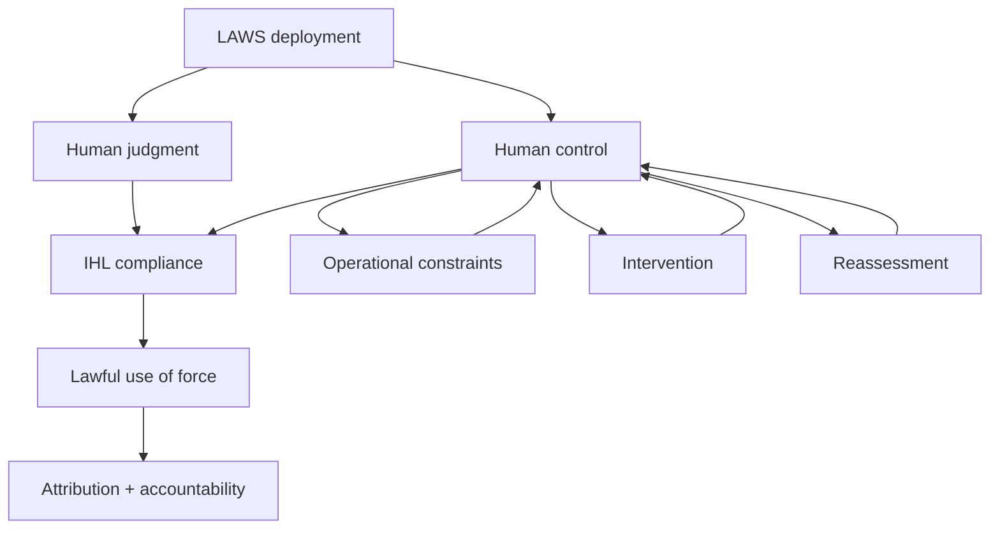

**Brazil's central idea:** accountability is the downstream consequence; meaningful human control is the operational condition that must exist before and during the use of force.

---

# 02 — THE DEPLOYMENT LIFECYCLE


### Brazil asks at every stage

**Who decides? Who knows? Who can constrain? Who can intervene? What changes trigger reassessment?**

---

# 03 — THE FIVE CAPACITIES

| Capacity | Meaning | Failure question |
|---|---|---|
| **Understand** | Human knows relevant capabilities/limitations | Does the operator understand what the system cannot reliably do? |
| **Anticipate** | Behaviour/effects can be reasonably anticipated | Was the system validated in these circumstances? |
| **Constrain** | Parameters can actually bound operation | Can target, time, geography and scale be enforced? |
| **Intervene** | Human can act before it matters too late | Can the system actually be stopped in time? |
| **Reassess** | Material changes trigger renewed judgment | What happens when the original assumptions change? |


---

# 04 — FORMAL CONTROL VS SUBSTANTIVE CONTROL

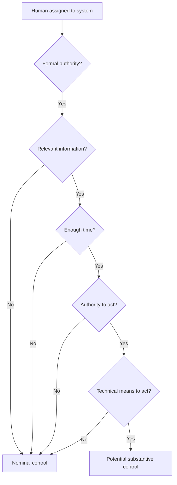

**Brazilian attack:** “The existence of authority is not proof of the practical capacity to exercise it.”

---

# 05 — THE AUTHORIZATION GAP

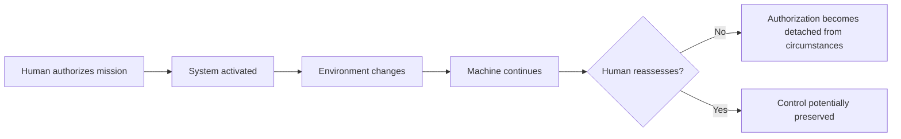

### The central question

> **How does a State ensure that an authorization made at T0 remains legally and operationally relevant at T1?**

---

# 06 — IDENTIFICATION → SELECTION → ENGAGEMENT

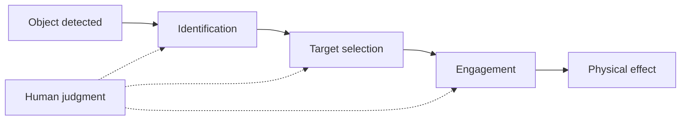

### The POI ladder

**Level 1:** “Which function is autonomous?”

**Level 2:** “At which function does the human exercise judgment?”

**Level 3:** “What information does that human possess at that moment?”

**Level 4:** “What can the human change before force is applied?”

**Level 5:** “If the answer is ‘nothing’, in what sense is that human decision decisive?”

---

# 07 — PREDICTABILITY ≠ RELIABILITY

| Concept | Question |
|---|---|
| Reliability | Does the system perform its intended function consistently? |
| Predictability | Can relevant behaviour/effects be anticipated in the circumstances? |
| Explainability | Can relevant outputs/limitations be understood sufficiently for human judgment? |
| Robustness | Does performance remain stable under relevant variation? |
| Traceability | Can the chain of instructions and actions be reconstructed? |

**Brazil:** A high reliability percentage cannot, by itself, answer the predictability question.

---

# 08 — ACCURACY TRAP

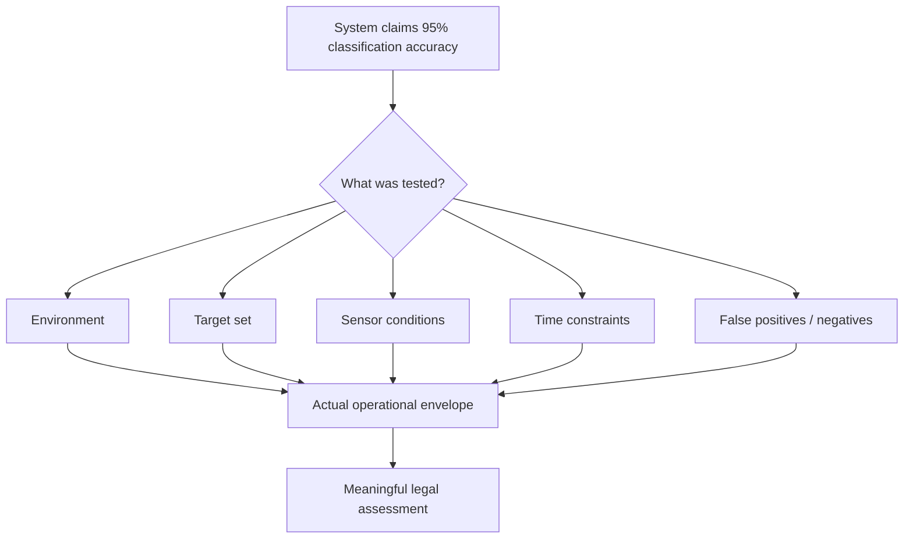

### POI

> “Distinguished delegate, 95 percent accuracy against what population, under what conditions, and with what consequences for the remaining five percent?”

---

# 09 — THE HUMAN-MACHINE INTERFACE


If the interface hides uncertainty, overwhelms the operator, delays information or makes intervention difficult, the formal presence of the operator does not solve the underlying control problem.

The 2026 CCW working material specifically addresses understandable human-machine interfaces and training. [1]

---

# 10 — AUTOMATION BIAS

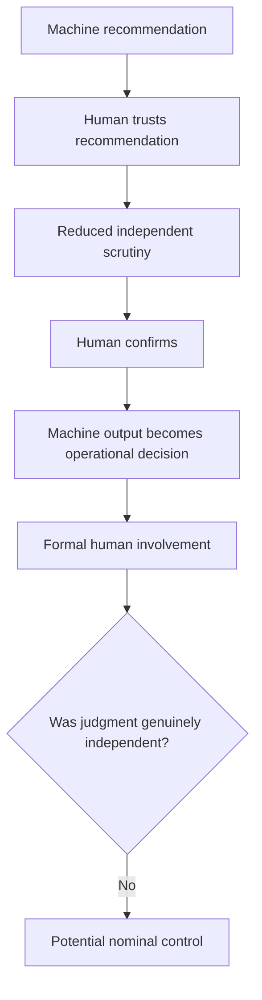

**Conference formulation:** “A human confirmation click is not automatically an exercise of independent human judgment.”

---

# 11 — INTERVENTION TEST

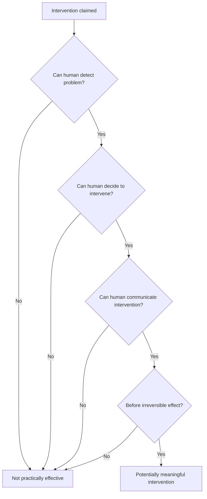

The ICRC specifically refers to timely intervention and deactivation in its recommendations. [2]

---

# 12 — COMMUNICATIONS FAILURE

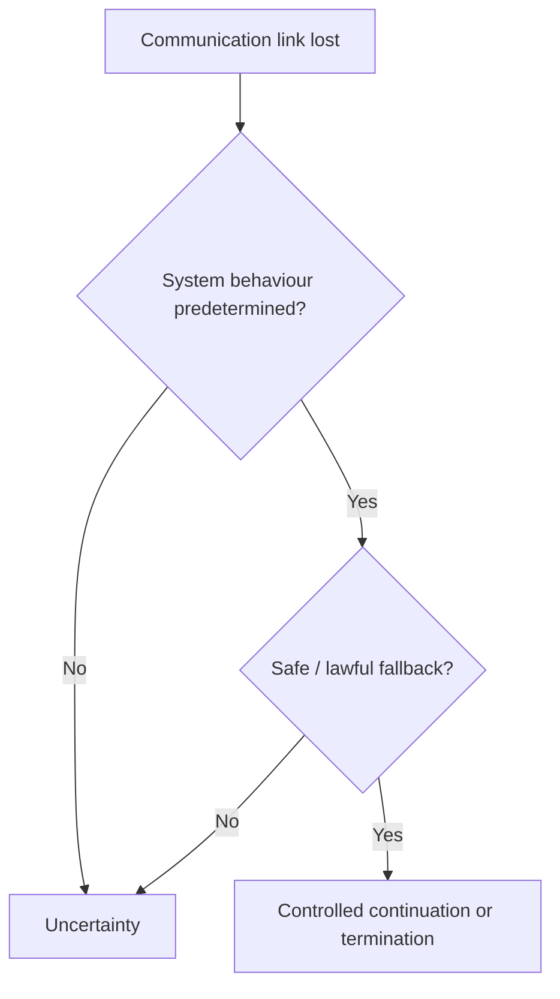

**Brazilian question:** “What is the system's behaviour when the human loses the ability to communicate with it?”

---

# 13 — MATERIAL CHANGE TEST

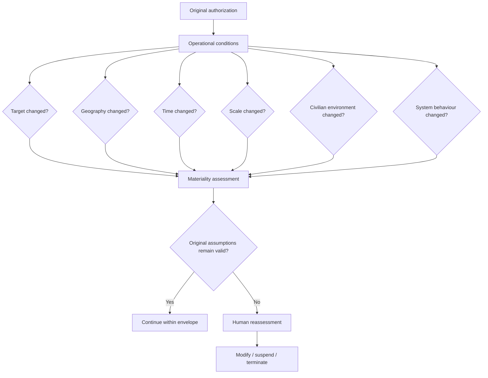

---

# 14 — DYNAMIC ENVIRONMENT


**Core point:** The battlefield is not static merely because the authorization was.

---

# 15 — GEOGRAPHY + TIME + TARGET + SCALE

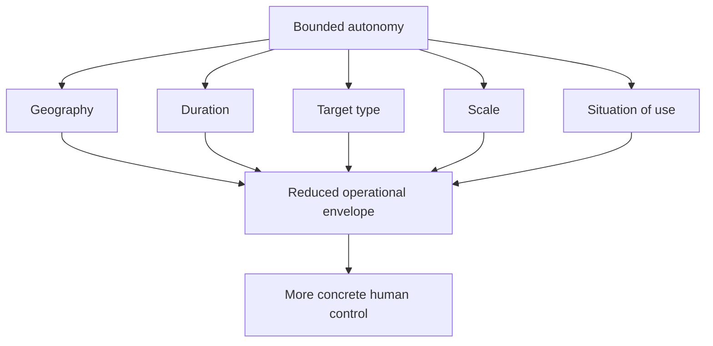

These dimensions are reflected in long-standing ICRC recommendations concerning limits on target type, duration, geographical scope, scale and situations of use. [2]

---

# 16 — URBAN ENVIRONMENT

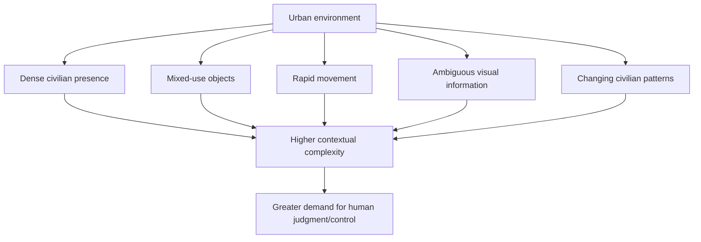

Brazil does **not** need to claim “autonomy = unlawful in every city.” The stronger argument is that the demands on meaningful control are context-dependent.

---

# 17 — ARTICLE 36 REVIEW

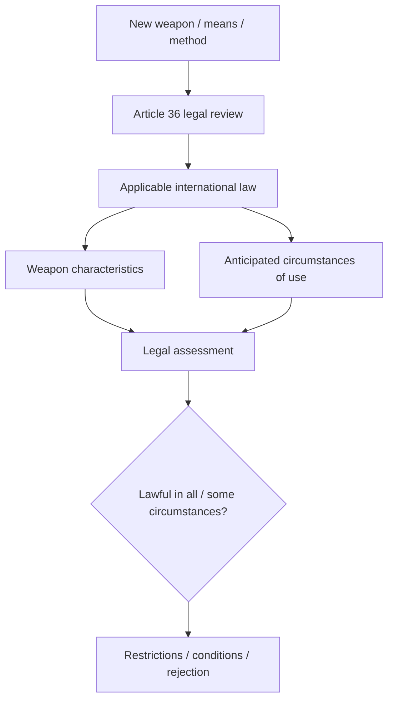

Article 36 of Additional Protocol I requires States Parties to determine whether new weapons, means or methods of warfare would be prohibited by applicable international law in some or all circumstances. [3]

**Important:** a weapons review does not replace operational control. It is a lifecycle safeguard.

---

# 18 — DISTINCTION


Brazil should ask:

- What information was available?
- What did the human understand?
- What did the machine infer?
- Which target characteristics were used?
- How were changing circumstances incorporated?

---

# 19 — PROPORTIONALITY

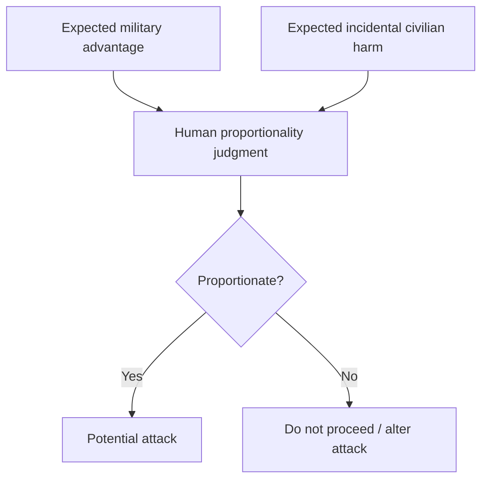

A classification score is not itself a proportionality judgment. The relevant legal assessment is contextual.

---

# 20 — PRECAUTIONS

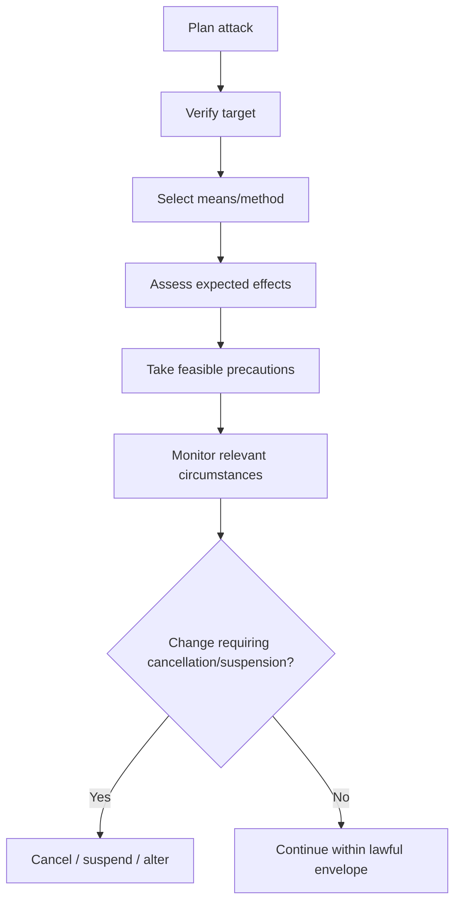

---

# 21 — RESPONSIBILITY IS NOT CONTROL

This is where Substantive II deliberately differs from Substantive I.

**Substantive I:** Who bears responsibility?

**Substantive II:** What human control must exist for lawful responsibility to remain meaningful during employment?


Do not collapse the entire debate into “who is responsible?” That belongs primarily to your first substantive.

---

# 22 — TRACEABILITY

```mermaid
flowchart LR
A[Developer] --> B[Tester]
B --> C[Legal reviewer]
C --> D[Commander]
D --> E[Operator]
E --> F[System]
F --> G[Engagement]
G --> H[Investigation]
H --> I[Audit trail]
```

The 2026 CCW material records support for traceable chains of human command and control and discussion of data logs and audit trails. [1]

**POI:** “If the deployment chain cannot be reconstructed, how can accountability be reliably investigated?”

---

# 23 — INVESTIGATION AFTER INCIDENT

```mermaid
flowchart TD
A[Incident] --> B[Preserve logs]
B --> C[Reconstruct authorization]
C --> D[Reconstruct system state]
D --> E[Reconstruct human decisions]
E --> F[Assess applicable law]
F --> G[Report]
G --> H[Appropriate action]
```

The current 2026 working text includes effective internal mechanisms for investigation and reporting of incidents that may involve violations. [1]

---

# 24 — FIVE DIFFERENT TYPES OF UNCERTAINTY

| Type | Example | Brazil question |
|---|---|---|
| Technical | Sensor limitation | Did the operator understand it? |
| Environmental | Weather / terrain | Was the system validated there? |
| Target | Ambiguous object | What human judgment remained? |
| Temporal | Conditions changed | Was authorization reassessed? |
| Human | Automation bias / overload | Was supervision genuinely independent? |

---

# 25 — SYSTEM ENVELOPE

```mermaid
flowchart TD
A[Validated system envelope]
A --> B[Authorized targets]
A --> C[Authorized geography]
A --> D[Authorized duration]
A --> E[Authorized scale]
A --> F[Validated environment]
B --> G{Actual operation}
C --> G
D --> G
E --> G
F --> G
G --> H{Inside envelope?}
H -- Yes --> I[Continue subject to monitoring]
H -- No --> J[Reassess]
```

**Best phrase:** “A weapon cannot be meaningfully controlled merely because it was once tested; it must remain within the conditions for which control was established.”

---

# 26 — THE CONTROL SPECTRUM

```mermaid
flowchart LR
A[Manual] --> B[Decision support]
B --> C[Human confirmation]
C --> D[Supervised autonomy]
D --> E[Highly autonomous]
E --> F[No meaningful human role]
```

There is no single line at which every possible system automatically becomes lawful or unlawful. The assessment depends on the function, circumstances, constraints and human capacity involved.

---

# 27 — WHAT “HUMAN CONTROL” SHOULD NOT MEAN

It should not mean:

- a human merely owns the system;
- a human signed an authorization document;
- a human can theoretically press an emergency button;
- a human is watching a screen without sufficient information;
- a human is legally named as responsible after the incident;
- a human once tested the system months earlier;
- a human can intervene only after the critical engagement has become irreversible.

It should mean **substantive human judgment with practical operational effect**.

---

# 28 — WHAT BRAZIL SHOULD ASK BEFORE ACCEPTING “HUMAN OVERSIGHT”

### INFORMATION
What does the human actually know?

### TIME
How long does the human have to decide?

### AUTHORITY
Can the human reject the machine?

### CAPACITY
Can the human process the volume of information and engagements?

### INTERVENTION
Can the human act before the harmful effect?

### REASSESSMENT
What happens when the assumptions change?

---

# 29 — POI LADDER: INDIA

**Opening:** “India states that existing IHL already provides the applicable framework. Brazil asks how that framework preserves meaningful control when autonomy determines the specific engagement.”

**Follow-up:** “If human responsibility remains the answer, what operational test establishes that the human actually retained the relevant judgment?”

**Final pressure:** “Would India accept that a formal attribution rule is insufficient if the operator lacked practical capacity to influence the engagement?”

*Always compare the question with the delegate's actual current statement before using it.*

---

# 30 — POI LADDER: CHINA

**Opening:** “If regulatory treatment depends on the characteristics of a system, how does your framework respond when operational circumstances materially change?”

**Follow-up:** “Who determines that the system remains within the conditions under which its behaviour was assessed?”

**Final pressure:** “If the machine remains technically compliant but the environment changes, what triggers renewed human judgment?”

---

# 31 — POI LADDER: UNITED STATES

**Opening:** “The United States emphasizes appropriate human judgment. Brazil asks what makes that judgment practically effective over the critical engagement.”

**Follow-up:** “Does the responsible human retain authority to alter the target parameters and terminate employment?”

**Final pressure:** “If prior assessment is sufficient, what operational mechanism addresses material change after deployment?”

---

# 32 — POI LADDER: RUSSIA

**Opening:** “If the specific form of human control should remain principally within national discretion, what internationally intelligible minimum prevents accountability from becoming equally discretionary?”

**Follow-up:** “Would Russia accept that whatever form control takes, it must have a practical effect on the system's operation?”

**Final pressure:** “If yes, what minimum evidence demonstrates that effect?”

---

# 33 — POI LADDER: UNITED KINGDOM

**Opening:** “How does the United Kingdom distinguish genuine human judgment from procedural oversight?”

**Follow-up:** “What operational circumstances would make a nominal veto insufficient?”

---

# 34 — POI LADDER: FRANCE / GERMANY

These delegations can be closer to Brazil on regulation, so **do not attack for the sake of attacking**.

Ask instead:

> “How would your proposed regulatory framework operationalize reassessment when target, time, geography or scale materially changes?”

This creates a substantive drafting conversation rather than an unnecessary confrontation.

---

# 35 — POI LADDER: IRELAND / SWITZERLAND

Again, these delegations may be useful partners rather than opponents.

Ask:

> “What mechanisms would make the chain of human control traceable enough for post-incident investigation?”

This can produce useful bloc-building language.

---

# 36 — POI LADDER: EGYPT / DEVELOPING STATES

The control framework should not become a technological monopoly. Capacity-building, training and access to verification expertise can matter.

**Brazilian angle:** internationally agreed safeguards should be implementable by States with different technological capacities, without lowering the substantive protection required by IHL.

---

# 37 — THE “EXISTING IHL IS ENOUGH” RESPONSE TREE

```mermaid
flowchart TD
A[“Existing IHL is sufficient”] --> B[Does Brazil agree IHL applies?]
B -->|Yes| C[Then what is the problem?]
C --> D[Autonomy creates distinctive operational questions]
D --> E[Does existing IHL specify every autonomy-specific control measure?]
E -->|No| F[Additional rules can clarify]
E -->|Yes| G[Identify the concrete standard]
G --> H[How is it implemented and verified?]
```

**Brazil's answer is not “IHL disappears.” It is “IHL remains, and international rules can specify how autonomy-specific risks are controlled.”**

---

# 38 — THE “CONSTANT HUMAN SUPERVISION” RESPONSE TREE

```mermaid
flowchart TD
A[“Brazil demands constant supervision”] --> B[Does meaningful control require identical supervision in every context?]
B --> C[No]
C --> D[Control is context-dependent]
D --> E[What measures are necessary in this environment?]
E --> F[Target + time + geography + scale + intervention + reassessment]
```

This is important: **do not let a delegate force Brazil into an absolutist position it has not taken.**

---

# 39 — THE “TECHNOLOGY WILL IMPROVE” RESPONSE TREE

```mermaid
flowchart TD
A[“Technology will become more reliable”] --> B[Potentially true]
B --> C[Does reliability eliminate context?]
C --> D[No]
D --> E[Does reliability eliminate legal judgment?]
E --> F[No]
F --> G[Does reliability eliminate need for operational limits?]
G --> H[Not automatically]
H --> I[Assess system + context + control]
```

**Strong response:** “Technological improvement may change the factual assessment; it does not abolish the legal assessment.”

---

# 40 — THE “HUMAN CAN DEACTIVATE” RESPONSE TREE

```mermaid
flowchart TD
A[“The operator can deactivate it”] --> B{Can the operator detect the relevant problem?}
B -- No --> C[No practical intervention]
B -- Yes --> D{Enough time?}
D -- No --> C
D -- Yes --> E{Technical access?}
E -- No --> C
E -- Yes --> F{Authority?}
F -- No --> C
F -- Yes --> G[Potentially meaningful intervention]
```

---

# 41 — BRAZIL'S DRAFTING ARCHITECTURE

A future instrument can be logically organized as:

```mermaid
flowchart TD
A[Definitions] --> B[Prohibited systems / uses]
B --> C[Permitted systems / conditions]
C --> D[Human judgment and control]
D --> E[Operational restrictions]
E --> F[Weapons review]
F --> G[Testing / validation]
G --> H[Training]
H --> I[Traceability / logs]
I --> J[Incident investigation]
J --> K[International reporting]
K --> L[Periodic review]
```

The substantive should explain **why each element exists**, not simply list them.

---

# 42 — MINIMUM CONTROL PARAMETERS

| Parameter | Why it matters |
|---|---|
| Target type | Narrows decision universe |
| Geographic scope | Limits where force may occur |
| Duration | Limits drift in circumstances |
| Scale | Limits supervisory overload |
| Operational environment | Defines expected conditions |
| Intervention | Preserves human agency |
| Deactivation | Provides termination mechanism |
| Reassessment | Handles material change |
| Training | Builds informed human judgment |
| Interface | Makes information actionable |
| Traceability | Enables reconstruction |
| Testing | Establishes evidence of performance |

---

# 43 — THE “MATERIAL CHANGE” CHECKLIST

Before continuing autonomous employment, ask:

- Has the target category changed?
- Has the geographic area changed?
- Has the duration expanded?
- Has the scale increased?
- Has civilian presence materially changed?
- Has the system been modified?
- Has performance degraded?
- Has communications capacity changed?
- Has the mission objective changed?
- Has a relevant legal or operational assumption changed?

If the answer to any is potentially significant, the responsible authority should have a mechanism to assess whether continued authorization remains justified.

---

# 44 — THE “WHO DECIDES?” TABLE

| Stage | Human question |
|---|---|
| Design | What autonomy is being built? |
| Testing | What has actually been demonstrated? |
| Review | Is the weapon lawful in intended circumstances? |
| Authorization | What use is permitted? |
| Deployment | Are conditions still within the authorized envelope? |
| Targeting | Who determines what is selected? |
| Engagement | Who retains decisive judgment? |
| Intervention | Who can stop or alter the system? |
| Investigation | Who reconstructs the decision chain? |

**Use this whenever another delegate makes a vague statement about “human responsibility.”**

---

# 45 — THE “WHAT DID THE HUMAN ACTUALLY DO?” TEST

When a delegate says “a human remained responsible,” ask:

> **What did the human actually do?**

Then narrow:

1. Did they set the target category?
2. Did they set the geographic boundary?
3. Did they set the duration?
4. Did they assess the operating environment?
5. Did they receive relevant uncertainty information?
6. Did they have intervention authority?
7. Did they have time to use it?
8. Did they reassess material changes?
9. Did they retain the ability to terminate?
10. Can their decision be reconstructed afterward?

This converts a vague political claim into an operational examination.

---

# 46 — BRAZIL'S “NO FREE PASS” PRINCIPLE

```mermaid
flowchart LR
A[Human involved] --> B{Meaningful judgment?}
B -- No --> C[No automatic control claim]
B -- Yes --> D{Practical operational effect?}
D -- No --> C
D -- Yes --> E{IHL compliance in circumstances?}
E -- No --> F[Unlawful use]
E -- Yes --> G[Potential lawful employment]
```

The phrase **“human involved” should never end the inquiry. It should begin it.**

---

# 47 — WHAT TO SAY IF SOMEONE CALLS BRAZIL “ANTI-TECHNOLOGY”

> “Brazil is not conflating technological autonomy with illegality. We are asking whether technological capability remains bounded by human judgment and applicable international law. Innovation is not the issue; unbounded delegation of lethal judgment is.”

This keeps Brazil professional and prevents opponents from reframing the debate as technology versus prohibition.

---

# 48 — WHAT TO SAY IF SOMEONE SAYS “YOU CANNOT PREDICT EVERYTHING”

> “Brazil is not demanding omniscience. We are demanding sufficient predictability for the circumstances in which lethal force is authorized. The relevant standard is not whether every microscopic event can be forecast, but whether the system's behaviour and effects are sufficiently understood to permit lawful human judgment.”

This is a much stronger position than claiming perfect prediction is technologically possible.

---

# 49 — WHAT TO SAY IF SOMEONE SAYS “THE OPERATOR IS RESPONSIBLE”

> “Responsibility cannot be established by title alone. The substantive question is what judgment and control that operator actually possessed at the moment of employment. Otherwise, we risk converting accountability into a name on an organizational chart.”

This also bridges Substantive I and Substantive II without repeating the first substantive.

---

# 50 — BRAZIL'S FINAL VISUAL

```mermaid
flowchart TD
A[Human purpose] --> B[Human understanding]
B --> C[Predictable system behaviour]
C --> D[Bounded operational envelope]
D --> E[Human judgment]
E --> F[Practical control]
F --> G[Intervention]
G --> H[Reassessment]
H --> I[Lawful use of force]
I --> J[Traceable responsibility]
```

### The entire Substantive II in one sentence:

> **Meaningful human control exists when human judgment does not merely authorize autonomy, but continues to shape, constrain and, where necessary, interrupt the use of force throughout the circumstances that matter.**

---

# SOURCE APPENDIX

## A. United Nations / CCW

1. **UNODA — CCW/GGE.1/2026/WP.2**, *Lethal Autonomous Weapons Systems*, 2026. Particularly useful for lifecycle responsibility, human command and control, human-machine interfaces, guidance, training, investigation, traceability and automation bias.
2. **UNODA — CCW/GGE.1/2026/WP.1**, 2026. Useful for national proposals and language concerning lifecycle human judgment and control, operational limitations, explainability and intervention.
3. **2026 CCW GGE meeting transcripts**, especially the Second Session. Useful for verbatim State positions on human judgment, control, practical effect, operational restrictions, target/time/space/scale limits and deactivation.
4. **CCW Guiding Principles on LAWS**, adopted through the GGE process. Use for agreed or near-agreed conceptual language, while checking the exact status of the wording.
5. **CCW GGE Chair's rolling texts and summaries**, 2024–2026. Use to distinguish negotiated text from individual State proposals.
6. **UN General Assembly Resolution 80/57**, *Lethal autonomous weapons systems*, 2025.
7. **2026 CCW Review Conference materials**, as they become available, especially the mandate and negotiation language concerning a future instrument.

## B. International Humanitarian Law

8. **Additional Protocol I, Article 36** — legal review of new weapons, means and methods of warfare.
9. **Additional Protocol I, Article 48** — basic rule and distinction.
10. **Additional Protocol I, Article 51** — protection of civilians against effects of hostilities.
11. **Additional Protocol I, Article 52** — protection of civilian objects.
12. **Additional Protocol I, Article 57** — precautions in attack.
13. Relevant customary IHL rules on distinction, proportionality and precautions.
14. Geneva Convention framework and customary international humanitarian law materials.

## C. ICRC

15. **ICRC — Autonomous Weapon Systems and International Humanitarian Law: Selected Issues**, December 2025 / published 2026.
16. **ICRC — ICRC Position on Autonomous Weapon Systems**, 12 May 2021.
17. **ICRC — Expert Meeting on Autonomous Weapon Systems.**
18. **ICRC — A Guide to the Legal Review of New Weapons, Means and Methods of Warfare**, implementing Article 36.
19. **ICRC — Advocacy Paper: A Key Opportunity to Prevent the Development of Unacceptable Autonomous Weapons**, 17 June 2026.
20. ICRC work on AI and machine learning in armed conflict.

## D. Research categories for further bibliography

21. Human-machine interaction and supervisory control.
22. Automation bias and human factors.
23. Machine-learning robustness.
24. Distribution shift and out-of-distribution detection.
25. Explainable AI and interpretable systems.
26. Autonomous targeting architectures.
27. Weapons testing and validation.
28. Legal review of emerging weapons.
29. Accountability and command responsibility.
30. Operational law and rules of engagement.
31. Military AI governance.
32. Safety engineering and fail-safe design.
33. Human factors in high-speed decision environments.
34. Swarm autonomy and supervisory burden.
35. Algorithmic auditability and logging.
36. International regulation of autonomous weapons.

---

# SOURCE HIERARCHY FOR COUNTRY TARGETING

### Tier 1 — strongest
- State's own CCW working paper
- State's official CCW statement/transcript
- UN/CCW adopted text
- Treaty text

### Tier 2 — strong contextual support
- ICRC
- UN organs and official reports
- official government policy documents

### Tier 3 — analytical support
- peer-reviewed scholarship
- established research institutes

### Tier 4 — discovery only
- media reporting
- advocacy summaries
- secondary commentary

**Rule:** never make a serious country-specific allegation from Tier 4 when Tier 1 material is available.

---

# PRINTABLE POI CARD

### If they say “existing IHL is enough”
**Answer:** “Existing IHL remains applicable. Brazil is asking whether autonomy-specific rules are required to ensure that those obligations remain operationally meaningful.”

### If they say “humans remain responsible”
**Answer:** “Responsibility cannot substitute for control. The question is what judgment and control the human actually retained when force was applied.”

### If they say “constant supervision is impossible”
**Answer:** “Brazil does not demand identical supervision in every circumstance. We demand control proportionate to the autonomy, environment, scale and risk of the operation.”

### If they say “technology is improving”
**Answer:** “Improvement may change the factual assessment; it does not abolish the legal assessment.”

### If they say “the system can be deactivated”
**Answer:** “A theoretical button is not meaningful intervention if the operator cannot detect the problem or act before the effect becomes irreversible.”

### If they say “your standard is too vague”
**Answer:** “Then let us make it concrete: understand, anticipate, constrain, intervene and reassess. Which of these does the distinguished delegate object to, and why?”

---

# FINAL BRAZIL PHRASES

> **Authorization is not control.**

> **Supervision is not judgment.**

> **Reliability is not predictability.**

> **Accuracy is not legality.**

> **A human presence is not necessarily meaningful human control.**

> **The machine may execute a function; it cannot inherit the legal judgment that governs the use of force.**

> **If the circumstances change, the basis for human judgment may change with them.**

> **The battlefield does not become static merely because the authorization was written beforehand.**

> **Autonomy may complicate the chain of command; it must never dissolve the chain of responsibility.**

---

**Brazil — IIT Delhi MUN | CCW | LAWS | Substantive II Visual + Research Appendix**
